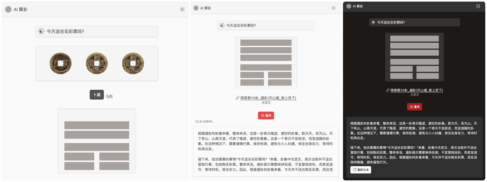

# 🧙 概述

**AI 算卦：** 通过进行六次硬币的随机卜筮，生成卦象，并使用 AI 对卦象进行分析。

## ⚙️ 设置

#### 环境变量

##### OpenAI 相关
- `OPENAI_API_KEY`：OpenAI API密钥
- `OPENAI_BASE_URL`：自定义 API 接口地址，默认：`https://api.openai.com/v1`
- `OPENAI_MODEL`：自定义 OpenAI 模型，默认：`gpt-3.5-turbo`

##### Google AI 相关
- `GOOGLE_API_KEY`：Google AI (Gemini) API密钥
- `GOOGLE_MODEL`：自定义 Google AI 模型，默认：`gemini-pro`
- `GOOGLE_BASE_URL`：自定义 Google AI 接口地址，默认：`https://generativelanguage.googleapis.com`

##### 模型选择
- `AI_TYPE`：选择使用的AI服务，可选值：`openai`（默认）或 `google`

## 🚀 本地运行

1. 克隆仓库：

```sh
git clone https://github.com/sunls24/divination
```

2. 安装依赖项：

```bash
pnpm install
```

3. 本地运行：

```bash
# 设置环境变量，创建.env.local文件并添加API密钥
touch .env.local
# 示例内容：
# OPENAI_API_KEY=sk-xxx
# 或
# GOOGLE_API_KEY=xxx
# AI_TYPE=google

# 本地运行
pnpm run dev
```

## ☁️ 使用 Vercel 部署

[](https://vercel.com/new/clone?repository-url=https%3A%2F%2Fgithub.com%2Fsunls23%2Fdivination&env=OPENAI_API_KEY)

---


